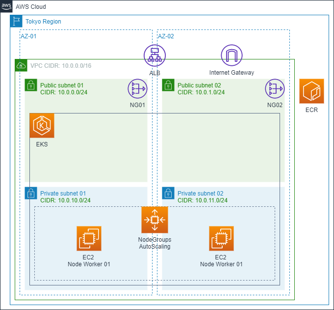

# I. 事前準備
## 1. 注意項目:
- [aws account id]は自分のアカウントidで切り替えてください。
- 全体構成図:

    

- デプロイ範囲:
    - EKS Cluster
    - EKS Worker Node: AutoScaler設定
    - AWS Application LoadBalancer for Ingress

## 2. OS
- AWS Linux
- AMI: amzn2-ami-ecs-hvm-2.0.20200402-x86_64-ebs 
- AMI ID: ami-032b1a02e6610214e

## 3. AWS CLI
- Version: 2.0.8

## 4. Install eksctl on Linux
- `curl --silent --location "https://github.com/weaveworks/eksctl/releases/latest/download/eksctl_$(uname -s)_amd64.tar.gz" | tar xz -C /tmp`
- `sudo mv /tmp/eksctl /usr/local/bin`
- `eksctl version`

    ```
    [ec2-user@ip-172-31-1-83 ~]$ eksctl version
    0.17.0
    ```

## 5. Install Docker 18.09.9-ce
## 6. Install Kubernetes 1.15

# II. EKSリソース作成
## 1. VPC、SUBNET作成
### 1.1 AWS Cloudformationでスタック作成
- 「1_eks_vpc.yaml」テンプレートでリソース作成
- 「2_eks-nodegroup.yaml」Nested Stackがあるので、TemplateURLの設定に注意する必要

### 1.2 テンプレート構築
    - VPC CIDR: 10.0.0.0/16
    - SUBNET:
        - PublicSubnet01: 10.0.0.0/24
        - PublicSubnet02: 10.0.1.0/24
        - PrivateSubnet01: 10.0.10.0/24
        - PrivateSubnet02: 10.0.11.0/24
    - NAT GATEWAY:
        - NAT GATEWAY 01
            - PublicSubnet01
            - Associcate with PrivateSubnet01
        - NAT GATEWAY 02
            - PublicSubnet02
            - Associcate with PrivateSubnet02
    - EKS:
        - Version: 1.16
        - Subnet:
            - PublicSubnet01
            - PublicSubnet02
            - PrivateSubnet01
            - PrivateSubnet02
    - EKS NodeGroup:
        - Type: t2.small
        - MinSize: 1
        - MaxSize: 3
        - DesiredSize: 2
        - Subnet:
            - PrivateSubnet01
            - PrivateSubnet02
        - Key:
            - eks_key

### 1.3 結果確認
- `aws eks describe-cluster --name eks-cluster --query cluster.status`
    ```
    [ec2-user@ip-172-31-1-83 ~]$ aws eks describe-cluster --name eks-cluster --query cluster.status
    "ACTIVE"
    ```

### 1.4 kubectlコマンドの設定 - (Kubernetes 1.15事前インストール)
- `aws eks update-kubeconfig --kubeconfig ~/.kube/config-eks --name eks-cluster`
- `export KUBECONFIG=~/.kube/config-eks`

## 2. 動作確認
- Get service information: `kubectl get svc`
    ```
    [ec2-user@ip-172-31-15-114 eks-operation-note]$ kubectl get svc
    NAME         TYPE        CLUSTER-IP   EXTERNAL-IP   PORT(S)   AGE
    kubernetes   ClusterIP   172.20.0.1   <none>        443/TCP   14m
    ```

- Get node information: `kubectl get nodes`
    ```
    [ec2-user@ip-172-31-15-114 eks-operation-note]$ kubectl get nodes
    NAME                                             STATUS   ROLES    AGE     VERSION
    ip-10-0-10-101.ap-northeast-1.compute.internal   Ready    <none>   6m35s   v1.16.8-eks-e16311
    ip-10-0-11-56.ap-northeast-1.compute.internal    Ready    <none>   6m24s   v1.16.8-eks-e16311
    ```

# III. Cluster Autoscaler のデプロイ
## 1. 簡単な説明
- Cluster Autoscaler は、以下のいずれかの条件に該当する場合に Kubernetes クラスターのサイズを自動的に調整するツールです。
    - リソース不足のため、クラスター内で実行に失敗したポッドがある。
    - クラスター内に長期間使用されていないノードがあり、それらのポッドを他の既存のノードに配置できる。
- AWS の Cluster Autoscaler は、指定された任意の Auto Scaling グループ内のワーカーノードを拡張し、クラスター内のデプロイメントとして実行されます。

## 2. デプロイのサンプルファイルをダウンロード
- `wget https://raw.githubusercontent.com/kubernetes/autoscaler/master/cluster-autoscaler/cloudprovider/aws/examples/cluster-autoscaler-autodiscover.yaml`

## 3. EKS クラスター名 (eks-cluster)) と環境変数を変更
    ```
        ...          
            command:
            - ./cluster-autoscaler
            - --v=4
            - --stderrthreshold=info
            - --cloud-provider=aws
            - --skip-nodes-with-local-storage=false
            - --expander=least-waste
            - --node-group-auto-discovery=asg:tag=k8s.io/cluster-autoscaler/enabled,k8s.io/cluster-autoscaler/eks-cluster
            env:
            - name: AWS_REGION
                value: [aws region]
        ...
    ```

## 4. Cluster Autoscaler デプロイ
- `kubectl apply -f cluster-autoscaler-autodiscover.yaml`

## 5. Cluster Autoscaler のデプロイログでデプロイエラーを確認
- `kubectl logs -f deployment/cluster-autoscaler -n kube-system`

# IV. Deploy Application Load Balancer Ingress
## 1. Create IAM OIDC provider and integrate to eks cluster
    ```
    eksctl utils associate-iam-oidc-provider \
        --region [aws region] \
        --cluster eks-cluster \
        --approve
    aws eks describe-cluster --name eks-cluster --query "cluster.identity.oidc.issuer" --output text
    ```
- oidcアウトプット「oidc.eks.[aws region].amazonaws.com/id/F376C23FDBA0958E51574E5A171A6292」を控えておく

## 2. Create ALBIngressControllerIAMPolicy
    ```
    curl https://raw.githubusercontent.com/kubernetes-sigs/aws-alb-ingress-controller/v1.1.4/docs/examples/iam-policy.json > ingress-iam-policy.json
    aws iam create-policy \
        --policy-name ALBIngressControllerIAMPolicy \
        --policy-document file://ingress-iam-policy.json
    ```
- ポリシarn「arn:aws:iam::[aws account id]:policy/ALBIngressControllerIAMPolicy」を控えておく

## 3. Create IAM ROLE for ALB Ingress Controller
### 3.1 Create assume-role-policy-document.json
- 上のoidcアウトプットで"Federated"と"StringEquals"を切り替え
    ```
    {
    "Version": "2012-10-17",
    "Statement": [
        {
        "Effect": "Allow",
        "Principal": {
            "Federated": "arn:aws:iam::[aws account id]:oidc-provider/oidc.eks.[aws region].amazonaws.com/id/F376C23FDBA0958E51574E5A171A6292"
        },
        "Action": "sts:AssumeRoleWithWebIdentity",
        "Condition": {
            "StringEquals": {
            "oidc.eks.[aws region].amazonaws.com/id/F376C23FDBA0958E51574E5A171A6292:aud": "sts.amazonaws.com"
            }
        }
        }
    ]
    }
    ```

### 3.2 Create Role by AWS CLI
    ```
    aws iam create-role \
        --role-name eks-alb-ingress-controller \
        --assume-role-policy-document file://assume-role-policy-document.json
    ```

### 3.3 ロールポリシ適用(上のポリシarnを使う)
- `aws iam attach-role-policy --policy-arn arn:aws:iam::[aws account id]:policy/ALBIngressControllerIAMPolicy --role-name eks-alb-ingress-controller`

## 4. kube-system名前空間にalb-ingress-controllerのKubernetesサービスアカウントを作成
- `kubectl apply -f https://raw.githubusercontent.com/kubernetes-sigs/aws-alb-ingress-controller/v1.1.4/docs/examples/rbac-role.yaml`

## 5. 作成したロールのARNでKubernetesサービスアカウントに注釈を付ける
    ```
    kubectl annotate serviceaccount -n kube-system alb-ingress-controller \
    eks.amazonaws.com/role-arn=arn:aws:iam::[aws account id]:role/eks-alb-ingress-controller
    ```

## 6. ALB Ingress Controllerをデプロイ
- `curl https://raw.githubusercontent.com/kubernetes-sigs/aws-alb-ingress-controller/v1.1.4/docs/examples/alb-ingress-controller.yaml > alb-ingress-controller.yaml`

- alb-ingress-controller.yamlに情報追加(vpc、region、eks name)
    ```
    spec:
      containers:
      - args:
        - --ingress-class=alb
        - --cluster-name=[eks-cluster-name]
        - --aws-vpc-id=[vpc id]
        - --aws-region=[aws region]
    ```

- `kubectl apply -f alb-ingress-controller.yaml`