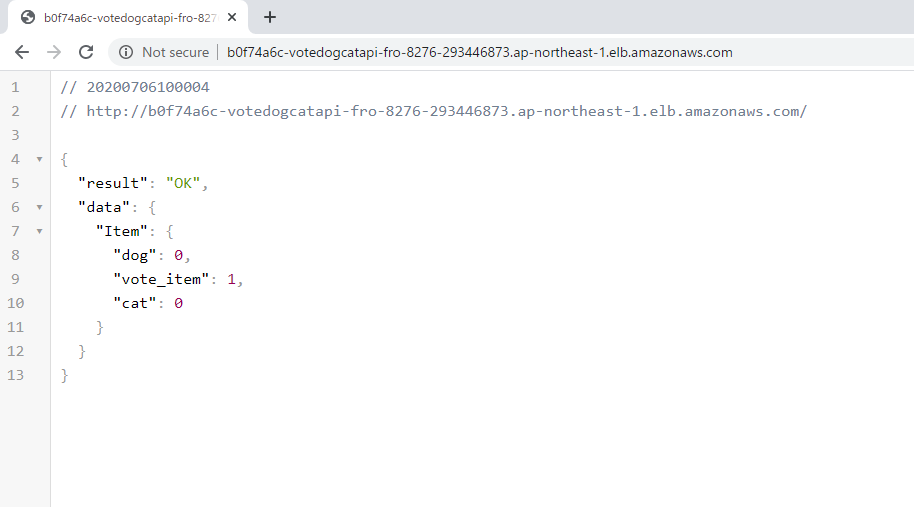

# HEML設定
- `brew install helm`
- `helm help`

# Chart開発
## 1. Chart作成「名：vote-dog-cat-api」
- `helm create vote-dog-cat-api`
    ```
    [ec2-user@ip-172-31-1-83 EKS]$ tree vote-dog-cat-api/
    vote-dog-cat-api/
    ├── charts
    ├── Chart.yaml
    ├── templates
    │   ├── deployment.yaml
    │   ├── _helpers.tpl
    │   ├── hpa.yaml
    │   ├── ingress.yaml
    │   ├── NOTES.txt
    │   ├── serviceaccount.yaml
    │   ├── service.yaml
    │   └── tests
    │       └── test-connection.yaml
    └── values.yaml
    ```

## 2. Chartの各テンプレート作成
- Customize template
    ```
    [ec2-user@ip-172-31-15-114 3.1 HELM]$ tree vote-dog-cat-api/
    vote-dog-cat-api/
    ├── Chart.yaml
    ├── templates
    │   ├── deployment.yaml
    │   ├── ingress.yaml
    │   ├── namespace.yaml
    │   └── service.yaml
    └── values.yaml
    ```
- namespace.yaml
    ```
    apiVersion: v1
    kind: Namespace
    metadata:
    name: {{ .Release.Name }}
    ```
- deployment.yaml 
    ```
    apiVersion: apps/v1
    kind: Deployment
    metadata:
    name: {{ .Values.backend.name }}
    namespace: {{ .Release.Name }}
    spec:
    replicas: {{ .Values.backend.replicas }}
    selector:
        matchLabels:
        app: {{ .Values.backend.name }}
    template:
        metadata:
        labels:
            app: {{ .Values.backend.name }}
        spec:
        containers:
        - name: {{ .Values.backend.name }}
            image: {{ .Values.backend.image.repo }}
            imagePullPolicy: {{ .Values.backend.image.pullPolicy }}
            ports:
            - containerPort: {{ .Values.backend.image.port }}
        restartPolicy: Always

    ---
    apiVersion: apps/v1
    kind: Deployment
    metadata:
    name: {{ .Values.frontend.name }}
    namespace: {{ .Release.Name }}
    spec:
    replicas: {{ .Values.frontend.replicas }}
    selector:
        matchLabels:
        app: {{ .Values.frontend.name }}
    template:
        metadata:
        labels:
            app: {{ .Values.frontend.name }}
        spec:
        containers:
        - name: {{ .Values.frontend.name }}
            image: {{ .Values.frontend.image.repo }}
            imagePullPolicy: {{ .Values.frontend.image.pullPolicy }}
            ports:
            - containerPort: {{ .Values.frontend.image.port }}
    ```
- service.yaml
    ```
    apiVersion: v1
    kind: Service
    metadata:
    labels:
        app: {{ .Values.backend.name }}
    name: {{ .Values.backend.name }}
    namespace: {{ .Release.Name }}
    spec:
    ports:
    - port: {{ .Values.backend.service.port }}
        targetPort: {{ .Values.backend.service.port }}
    selector:
        app: {{ .Values.backend.name }}
    type: {{ .Values.backend.service.type }}
        
    ---
    apiVersion: v1
    kind: Service
    metadata:
    labels:
        app: {{ .Values.frontend.name }}
    name: {{ .Values.frontend.name }}
    namespace: {{ .Release.Name }}
    spec:
    ports:
    - port: {{ .Values.frontend.service.port }}
        targetPort: {{ .Values.frontend.service.port }}
    selector:
        app: {{ .Values.frontend.name }}
    type: {{ .Values.frontend.service.type }}
    ```
- ingress.yaml
    ```
    apiVersion: extensions/v1beta1
    kind: Ingress
    metadata:
    name: {{ .Values.frontend.name }}
    namespace: {{ .Release.Name }}
    annotations:
        kubernetes.io/ingress.class: alb
        alb.ingress.kubernetes.io/scheme: internet-facing
    labels:
        app: {{ .Values.frontend.name }}
    spec:
    rules:
        - http:
            paths:
            - path: /*
                backend:
                serviceName: {{ .Values.frontend.name }}
                servicePort: {{ .Values.frontend.service.port }}
    ```

## 3. Values提供
- vaules.yaml
    ```
    backend:
    name: dynamodb
    replicas: 1
    image: 
        repo: amazon/dynamodb-local
        pullPolicy: IfNotPresent
        port: 8000
    service:
        type: ClusterIP
        port: 8000

    frontend:
    name: frontend
    replicas: 1
    image: 
        repo: duynamvnn1208/appserver:latest
        pullPolicy: Always
        port: 80
    service:
        type: NodePort
    ```

# Helm Commands理解
## 1. Helm Lint: Chartの形式を確認
- `helm lint ./vote-dog-cat-api`
    ```
    [ec2-user@ip-172-31-1-83 eks-operation]$ helm lint ./vote-dog-cat-api
    ==> Linting ./vote-dog-cat-api
    [INFO] Chart.yaml: icon is recommended

    1 chart(s) linted, 0 chart(s) failed
    ```

## 2. Helm Template: manifest内容確認
- `helm template ./vote-dog-cat-api`

## 3. Helm Install
### review before insall
- `helm install --dry-run --debug vote-dog-cat-api ./vote-dog-cat-api`

### helm install
- `helm install vote-dog-cat-api ./vote-dog-cat-api`
    ```
    [ec2-user@ip-172-31-15-114 3.1 HELM]$ helm install vote-dog-cat-api ./vote-dog-cat-api
    NAME: vote-dog-cat-api
    LAST DEPLOYED: Mon Jul  6 00:54:49 2020
    NAMESPACE: default
    STATUS: deployed
    REVISION: 1
    TEST SUITE: None
    ```

    

### Uninstall
- `helm uninstall vote-dog-cat-api`

    ```
    [ec2-user@ip-172-31-15-114 kubenetes]$ helm uninstall vote-dog-cat-api
    release "vote-dog-cat-api" uninstalled
    ```

## 4. Helm Get
- `helm ls`

## 5. Helm Upgrade
- `helm upgrade vote-dog-cat-api ./vote-dog-cat-api`

## 6. Helm Rollback
- `helm rollback vote-dog-cat-api 1`

## 7. Helm Delete
- `helm delete --purge vote-dog-cat-api`

# Distributing Charts
## 1. Helm Package
- `helm package ./vote-dog-cat-api`

## 2. Helm Repo　→　未検討
- `helm repo index my-repo/ --url https://<username>.github.io/my-repo`
- `helm repo add my-repo https://my-pages.github.io/my-repo`
- `helm install my-repo/vote-dog-cat-api --name=vote-dog-cat-api`