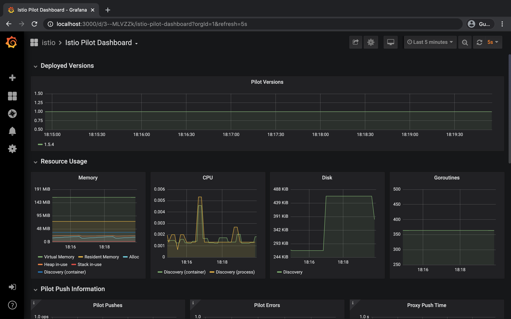

# I. Istio設定
## 1. Istio download
- `curl -L https://istio.io/downloadIstio | sh -`
- `cd istio-1.6.4/`
- `export PATH=$PWD/bin:$PATH`
## 2. Istio設定
- `istioctl manifest apply --set profile=demo`
  ```
  [ec2-user@ip-172-31-15-114 istio-1.6.4]$ istioctl manifest apply --set profile=demo
  - Applying manifest for component Base...
  ✔ Finished applying manifest for component Base.
  - Applying manifest for component Pilot...
  ✔ Finished applying manifest for component Pilot.
    Waiting for resources to become ready...
    Waiting for resources to become ready...
    Waiting for resources to become ready...
    Waiting for resources to become ready...
    Waiting for resources to become ready...
    Waiting for resources to become ready...
    Waiting for resources to become ready...
    Waiting for resources to become ready...
    Waiting for resources to become ready...
  - Applying manifest for component IngressGateways...
  - Applying manifest for component EgressGateways...
  - Applying manifest for component AddonComponents...
  ✔ Finished applying manifest for component EgressGateways.
  ✔ Finished applying manifest for component IngressGateways.
  ✔ Finished applying manifest for component AddonComponents.


  ✔ Installation complete
  ```

### 他のオプション

|                        | default | demo | minimal	| remote | 
| ---------------------- | ------- | ---- | ------- | ------ | 
| **Core components**    |         |      |         |        | 
|   istio-egressgateway  |         |   X  |         |        | 
|   istio-ingressgateway |    X    |   X  |         |        | 
|   istio-pilot          |    X    |   X  |         |        | 
| **Addons**             |         |      |         |        | 
|   grafana              |         |   X  |         |        | 
|   istio-tracing        |         |   X  |         |        | 
|   kiali                |         |   X  |         |        | 
|   prometheus           |    X    |   X  |         |    X   | 

## 3. k8s namespaceを作成、アプリケーションにEnvoy Sidecarを自動的に挿入するように設定
- `kubectl create ns vote-dog-cat-api`
- `kubectl label namespace vote-dog-cat-api istio-injection=enabled`
- `kubectl get namespace -L istio-injection`
  ```
  [ec2-user@ip-172-31-15-114 istio-1.6.4]$ kubectl get namespace -L istio-injection
  NAME               STATUS   AGE     ISTIO-INJECTION
  default            Active   49m     
  istio-system       Active   2m32s   disabled
  kube-node-lease    Active   49m     
  kube-public        Active   49m     
  kube-system        Active   49m     
  vote-dog-cat-api   Active   3m31s   enabled
  ```
- `kubectl get pod -n istio-system`
  ```
  [ec2-user@ip-172-31-15-114 istio-1.6.4]$ kubectl get pod -n istio-system
  NAME                                   READY   STATUS    RESTARTS   AGE
  grafana-5cc7f86765-kht42               1/1     Running   0          8m5s
  istio-egressgateway-5b44cc8b8b-qg8v8   1/1     Running   0          8m7s
  istio-ingressgateway-8f8dd5f54-sbfnx   1/1     Running   0          8m7s
  istio-tracing-8584b4d7f9-lfj8q         1/1     Running   0          8m4s
  istiod-899ff588f-ljdtd                 1/1     Running   0          8m31s
  kiali-696bb665-qqb8x                   1/1     Running   0          8m4s
  prometheus-54ccf8ddf8-dfgwq            2/2     Running   0          8m4s
  ```
- `kubectl get svc -n istio-system`
  ```
  [ec2-user@ip-172-31-15-114 istio-1.6.4]$ kubectl get svc -n istio-system
  NAME                        TYPE           CLUSTER-IP       EXTERNAL-IP                                                                   PORT(S)                                                                                                                                      AGE
  grafana                     ClusterIP      172.20.216.170   <none>                                                                        3000/TCP                                                                                                                                     9m13s
  istio-egressgateway         ClusterIP      172.20.83.131    <none>                                                                        80/TCP,443/TCP,15443/TCP                                                                                                                     9m16s
  istio-ingressgateway        LoadBalancer   172.20.71.4      a501251191d3f4fc2a7dd63541cc7e43-910129893.ap-northeast-1.elb.amazonaws.com   15020:31555/TCP,80:30140/TCP,443:30300/TCP,15029:32758/TCP,15030:32253/TCP,15031:32372/TCP,15032:31862/TCP,31400:32623/TCP,15443:31104/TCP   9m15s
  istio-pilot                 ClusterIP      172.20.230.243   <none>                                                                        15010/TCP,15011/TCP,15012/TCP,8080/TCP,15014/TCP,443/TCP                                                                                     9m40s
  istiod                      ClusterIP      172.20.70.172    <none>                                                                        15012/TCP,443/TCP                                                                                                                            9m40s
  jaeger-agent                ClusterIP      None             <none>                                                                        5775/UDP,6831/UDP,6832/UDP                                                                                                                   9m13s
  jaeger-collector            ClusterIP      172.20.123.192   <none>                                                                        14267/TCP,14268/TCP,14250/TCP                                                                                                                9m13s
  jaeger-collector-headless   ClusterIP      None             <none>                                                                        14250/TCP                                                                                                                                    9m13s
  jaeger-query                ClusterIP      172.20.39.125    <none>                                                                        16686/TCP                                                                                                                                    9m13s
  kiali                       ClusterIP      172.20.253.31    <none>                                                                        20001/TCP                                                                                                                                    9m13s
  prometheus                  ClusterIP      172.20.96.178    <none>                                                                        9090/TCP                                                                                                                                     9m13s
  tracing                     ClusterIP      172.20.241.87    <none>                                                                        80/TCP                                                                                                                                       9m13s
  zipkin                      ClusterIP      172.20.249.1     <none>                                                                        9411/TCP   
  ```

# 4. Add Envoy Sidecar to deployment
- [annotations] に [sidecar.istio.io/inject: "true"]を追加
  ```
  apiVersion: apps/v1
  kind: Deployment
  metadata:
    name: {{ .Values.backend.name }}
    namespace: {{ .Values.namespace }}
  spec:
    replicas: {{ .Values.backend.replicas }}
    selector:
      matchLabels:
        app: {{ .Values.backend.name }}
    template:
      metadata:
        labels:
          app: {{ .Values.backend.name }}
        annotations:
          sidecar.istio.io/inject: "true" # add envoy sidecar
      spec:
        containers:
        - name: {{ .Values.backend.name }}
          image: {{ .Values.backend.containers.image }}
          imagePullPolicy: {{ .Values.backend.containers.imagePullPolicy }}
          ports:
          - containerPort: {{ .Values.backend.containers.containerPort }}
        restartPolicy: Always
  ```

# II. HELMデプロイ、IstioでMicroservice管理
## 1. アプリケーションデプロイ
- `helm install vote-dog-cat-api vote-dog-cat-api/`
  ```
  [ec2-user@ip-172-31-15-114 4. istio]$ helm install vote-dog-cat-api vote-dog-cat-api/
  NAME: vote-dog-cat-api
  LAST DEPLOYED: Mon Jul  6 01:31:41 2020
  NAMESPACE: default
  STATUS: deployed
  REVISION: 1
  TEST SUITE: None
  ```

## 2. Istio Ingressとvote-dog-cat-apiのserviceを結合するためGatewayとVirtualServiceデプロイ
- `kubectl apply -f gateway.yaml`

  ```
  [ec2-user@ip-172-31-15-114 4. istio]$ kubectl apply -f gateway.yaml
  gateway.networking.istio.io/vote-dog-cat-gateway created
  virtualservice.networking.istio.io/vote-dog-cat created
  [ec2-user@ip-172-31-15-114 istio]$ kubectl get gateway -n vote-dog-cat-api
  NAME                   AGE
  vote-dog-cat-gateway   17s
  ```

## 3. 結果確認
- `kubectl get svc -n istio-system`
- ELBのDNを取得し、ブラウザーで確認


# III. Istioの監視
## 1. Istio監視 - KIALI
- `istioctl dashboard kiali`
  ```
  user: admin
  password: admin
  ```
- http://localhost:20001


## 2. Istioメトリック - GRAFANA
- `istioctl dashboard grafana`
- http://localhost:3000


## 3. Istioトレース - jaeger
- Service を 何か選択(例でdetails.default)し、「Find Traces」を押すと下記のように見える。
- `istioctl dashboard jaeger`
- http://localhost:16686


## 4. Add Grafana Loki Depyloy By Helm
### 4.1 Add Loki Repository
- `helm repo add loki https://grafana.github.io/loki/charts; helm repo update`

### 4.2 Install Loki
- `helm install loki loki/loki-stack -n istio-system`

### 4.3 Grafanaコンフィグレーション画面にLokiデータソースを追加


### 4.4 Exploer画面でLokiログ確認


### 4.5 Exploer画面でLokiログ確認-Add Parameter


# IV. Traffic Routing with Istio
## 1. Add Appserver02 to Helm
- frontend:
  - replicas: 1
  - image: duynamvnn1208/appserver:latest
- frontend2:
  - replicas: 1
  - image: duynamvnn1208/appserver02:latest

- `helm upgrade vote-dog-cat-api ./vote-dog-cat-api`
  ```
  [ec2-user@ip-172-31-15-114 4. istio]$ helm upgrade vote-dog-cat-api ./vote-dog-cat-api
  Release "vote-dog-cat-api" has been upgraded. Happy Helming!
  NAME: vote-dog-cat-api
  LAST DEPLOYED: Mon Jul  6 02:11:49 2020
  NAMESPACE: default
  STATUS: deployed
  REVISION: 2
  TEST SUITE: None
  ```

## 2. Change Weight specific service
- Deploy 2 service:
  - frontend: 50% traffic
  - frontend2: 50% traffic
- Create gateway.yaml
  ```
  apiVersion: networking.istio.io/v1alpha3
  kind: VirtualService
  metadata:
    name: vote-dog-cat
    namespace: vote-dog-cat-api
  spec:
    hosts:
    - "*"
    trafficPolicy:
      connectionPool:
        tcp:
          maxConnections: 100
    gateways:
    - vote-dog-cat-gateway
    http:
    - match:
      - uri:
          prefix: /
      route:
      - destination:
          host: frontend
        weight: 50
      - destination:
          host: frontend2
        weight: 50
  ```
- `kubectl apply -f gateway.yaml`

## 2. Restrict access for special Header
- Deploy 2 service:
  - frontend: default
  - frontend2: header set "super: frontend2"
- Create gateway.yaml
  ```
  apiVersion: networking.istio.io/v1alpha3
  kind: VirtualService
  metadata:
    name: vote-dog-cat
    namespace: vote-dog-cat-api
  spec:
    hosts:
    - "*"
    trafficPolicy:
      connectionPool:
        tcp:
          maxConnections: 100
    gateways:
    - vote-dog-cat-gateway
    http:
    - match:
      - headers:
            super:
              exact: frontend2
      route:
      - destination:
          host: frontend2
    - route:
      - destination:
          host: frontend
  ```
## 3. 結果確認
- `curl -H "super: frontend2" http://a501251191d3f4fc2a7dd63541cc7e43-910129893.ap-northeast-1.elb.amazonaws.com/`
  ```
  [ec2-user@ip-172-31-15-114 4. istio]$ curl -H "super: frontend2" http://a501251191d3f4fc2a7dd63541cc7e43-910129893.ap-northeast-1.elb.amazonaws.com/
  {"result":"OK","data":{"Item":{"dog":0,"vote_item":1,"cat":0}},"message":"This is appserver 02"}
  ```

## 4. Limit IP & Port

# V. Deploy Blue-Green
## 1. Deploy Blue Environment
### 1.1. Helmテンプレートのvalue.yamlのreplicas値を変更
  ```
  frontend:
    name: frontend
    replicas: 2
    containers: 
      image: duynamvnn1208/appserver:latest
        ...

  frontend2:
    name: frontend2
    replicas: 0
    containers: 
      image: duynamvnn1208/appserver02:latest
        ...
  ```
### 1.2. gateway.yamlのdestination値を変更
  ```
  ...
  - destination:
      host: frontend
  ```
### 1.3. Blueデプロイ
- `helm install vote-dog-cat-api vote-dog-cat-api/`

### 1.4. デプロイ確認
  ```
  [ec2-user@ip-172-31-15-114 4. istio]$  kubectl get pods -n "vote-dog-cat-api"
  NAME                        READY   STATUS    RESTARTS   AGE
  dynamodb-577f7c4bd9-mfhpd   2/2     Running   0          4m29s
  frontend-78cb79cff5-hhrrl   2/2     Running   0          4m29s
  frontend2-5fb68c4c7-br4d5   2/2     Running   0          4m29s
  ```
### 1.5. GatewayとVirtualServiceデプロイ
- `kubectl apply -f gateway.yaml`
- Blue環境：
  

## 2. Deploy Green Environment
### 2.1. Helmテンプレートのvalue.yamlのreplicas値を変更
  ```
  frontend:
    name: frontend
    replicas: 2
    containers: 
      image: duynamvnn1208/appserver:latest
        ...

  frontend2:
    name: frontend2
    replicas: 2
    containers: 
      image: duynamvnn1208/appserver02:latest
        ...
  ```
### 2.2. gateway.yamlのweight値を変更
  ```
  ...
  - destination:
      host: frontend2
  ```
- 他のやり方はWeightの値を変更することです。
  ```
  ...
  - destination:
      host: frontend
    weight: 0
  - destination:
      host: frontend2
    weight: 100
  ```
### 2.3. Greenデプロイ
- `helm upgrade vote-dog-cat-api vote-dog-cat-api/`

### 2.4. デプロイ確認
  ```
  [ec2-user@ip-172-31-15-114 istio]$ kubectl get pods -n "vote-dog-cat"
  NAME                         READY   STATUS    RESTARTS   AGE
  dynamodb-577f7c4bd9-jzq48    2/2     Running   0          27m
  frontend-65b44bb-vg5v7       2/2     Running   0          22m
  frontend-65b44bb-w5j8z       2/2     Running   0          22m
  frontend2-7f97bc4cd4-6rhkc   2/2     Running   0          28s
  frontend2-7f97bc4cd4-tww6n   2/2     Running   0          28s
  ```

### 2.5. frontend2へistio-ingressgatewayを転向する
- `kubectl apply -f gateway.yaml`
- Green環境:
  

## 3. Blue環境削除
### 3.1. value.yamlのreplicas値を変更
  ```
  frontend:
    name: frontend
    replicas: 0
    containers: 
      image: duynamvnn1208/appserver:latest
        ...

  frontend2:
    name: frontend2
    replicas: 2
    containers: 
      image: duynamvnn1208/appserver02:latest
        ...
  ```

### 3.2. Blue環境削除
- `helm upgrade vote-dog-cat-api vote-dog-cat-api/`

### 3.3. Blue環境削除確認
  ```
  [ec2-user@ip-172-31-15-114 istio]$ kubectl get pods -n "vote-dog-cat"
  NAME                         READY   STATUS    RESTARTS   AGE
  dynamodb-577f7c4bd9-jzq48    2/2     Running   0          32m
  frontend2-7f97bc4cd4-6rhkc   2/2     Running   0          4m36s
  frontend2-7f97bc4cd4-tww6n   2/2     Running   0          4m36s
  ```

## VI. Customize Istio Deploy
### 1. istioctlレポから「istio-custom-manifest.yaml」作成
- `istioctl manifest generate --set profile=demo > istio-custom-manifest.yaml`
- istio-custom-manifest.yaml変更を行う。

### 2. Istioデプロイした後、manifestを重なる
- `istioctl manifest apply --set profile=demo`
- ここでは「istio-ingress」サービスのタイプはLoadbancer
- ALBデプロイしようとしたら、Istioのmanifestを重なうためデプロイ行う。
- `kubectl apply -f istio-ingress-service-replace.yaml`

# 参考資料
- Istio Start:
  - https://istio.io/docs/setup/getting-started/

- Traffic Shifting:
  - https://istio.io/docs/tasks/traffic-management/traffic-shifting/