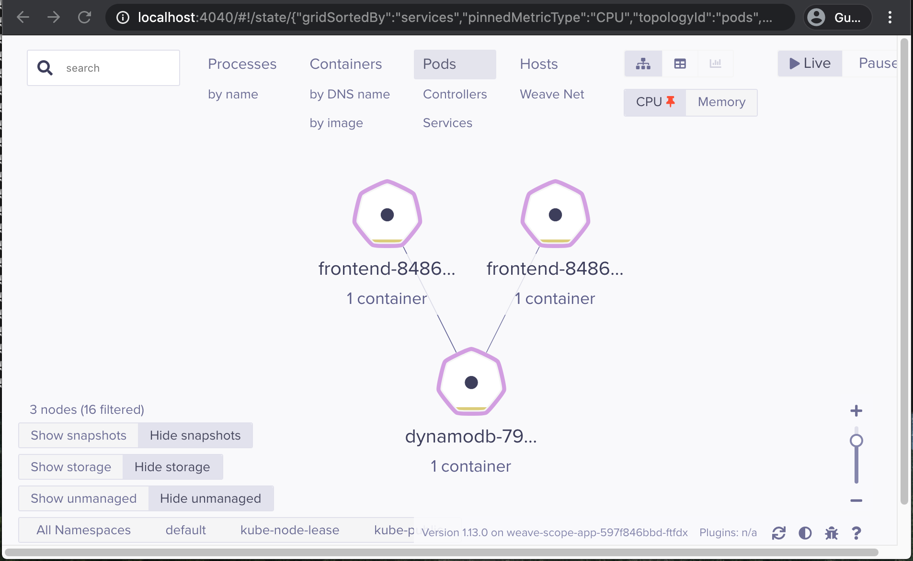

# Weave Scopeでk8s監視
## Weave Scope設定
- `kubectl apply -f "https://cloud.weave.works/k8s/scope.yaml?k8s-version=$(kubectl version | base64 | tr -d '\n')"`

## PORT-FORWARD設定
- `kubectl port-forward -n weave "$(kubectl get -n weave pod --selector=weave-scope-component=app -o jsonpath='{.items..metadata.name}')" 4040`

## 結果確認
- `http://localhost:4040`
