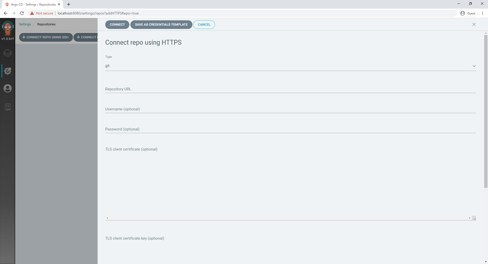
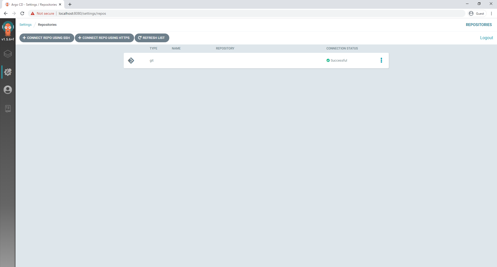
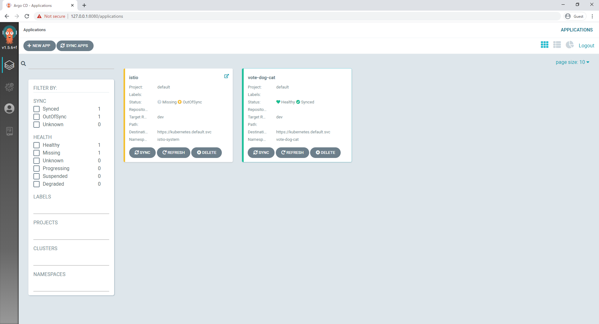

# II. ArgoCD設定
## 1. Install ArgoCD
    ```
    kubectl create namespace argocd
    kubectl apply -n argocd -f https://raw.githubusercontent.com/argoproj/argo-cd/stable/manifests/install.yaml
    ```

## 2. Download Argo CD CLI
    ```
    brew tap argoproj/tap
    brew install argoproj/tap/argocd
    ```

## 3. Port Forwarding
- `kubectl port-forward svc/argocd-server -n argocd 8080:443`

## 4. Login ArgoCD
- `https://locahost:8080`
- userName: admin
- password: argocd-server-565b7b754d-bmhvq (argocd-serverのpod-name)

# II. ArgoCDと操作 
## 1. Connect to Git Repository



## 2. Two opitons to create new app in ArgoCD
- Use with HELM Project
- Use with Kustomize Project

## 3. デプロイするためSYNC行い
