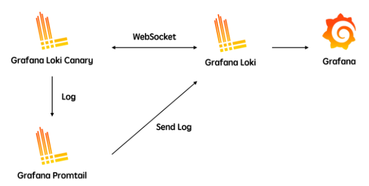
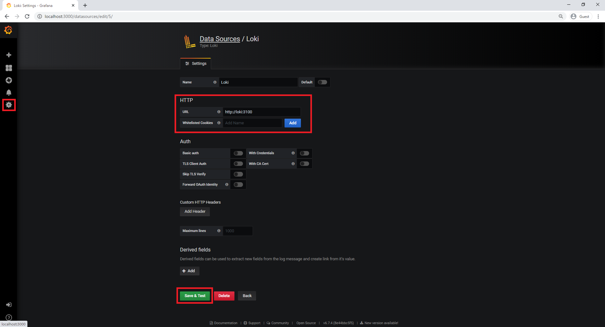
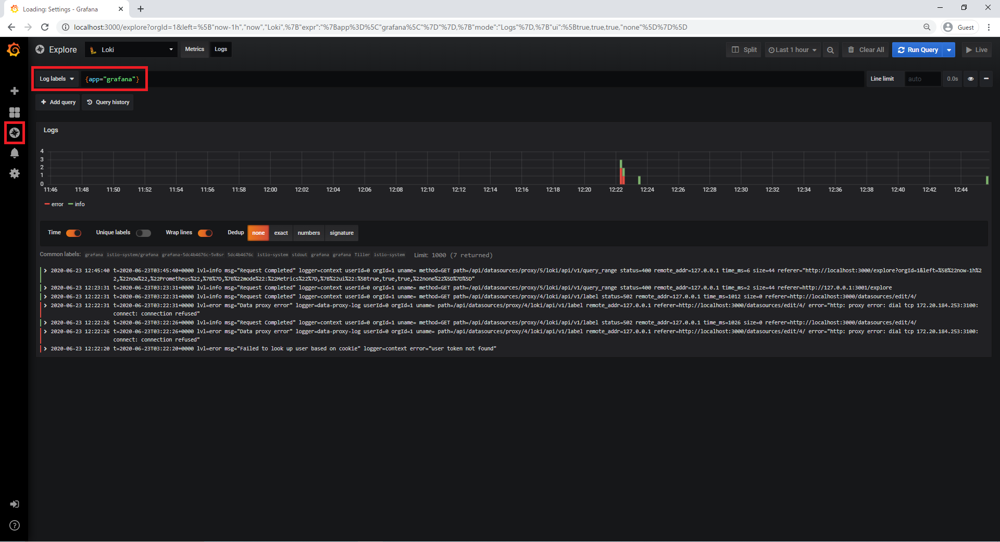
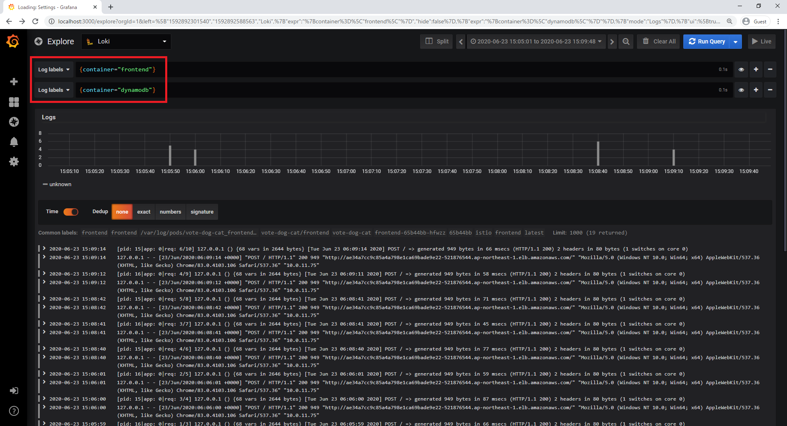

# LOKI: HELM & KUSTOMZE BETTER TOGETHER

## 1. loki helmレポ追加
- `helm repo add loki https://grafana.github.io/loki/charts`
- `helm repo update`
- `helm search repo loki`
    - loki/loki-stack – deploys the whole observability: Prometheus, Grafana, Promtail, fluent-bit & Loki.
    - loki/loki – Helm chart for just Loki, the log aggregator.
    - loki/promtail – chart for Promtail, which is a log shipping agent.
    - loki/fluent-bit – deploys fluent-bit, which is a different log shipping agent.

## 2. kustomizeパケージ作成
- 2.1 loki logs保存容量を制限する:
    - size: 10Gi
    ```
    helm template loki loki/loki-stack --set fluent-bit.enabled=false,promtail.enabled=true,loki.persistence.enabled=true,loki.persistence.size=10Gi -n istio-system > loki.yaml
    ```
    - loki.yamlの「kind: StatefulSet」の「env:」を削除(行788)
    - 以下の部分も削除する
    ```
    ---
    # Source: loki-stack/templates/tests/loki-test-pod.yaml
    apiVersion: v1
    kind: Pod
    metadata:
    annotations:
        "helm.sh/hook": test-success
    labels:
        app: loki-stack
        chart: loki-stack-0.38.1
        release: loki
        heritage: Helm
    name: loki-loki-stack-test
    spec:
    containers:
    - name: test
        image: bats/bats:v1.1.0
        args:
        - /var/lib/loki/test.sh
        env:
        - name: LOKI_SERVICE
        value: loki
        - name: LOKI_PORT
        value: "3100"
        volumeMounts:
        - name: tests
        mountPath: /var/lib/loki
    restartPolicy: Never
    volumes:
    - name: tests
        configMap:
        name: loki-loki-stack-test

    ```
- 2.2 logs retention設定できるように、loki-conf.yaml作成
    - retention_periodは168hの倍です。(7d)
    ```
    auth_enabled: false
    chunk_store_config:
    max_look_back_period: 0s
    ingester:
    chunk_block_size: 262144
    chunk_idle_period: 3m
    chunk_retain_period: 1m
    lifecycler:
        ring:
        kvstore:
            store: inmemory
        replication_factor: 1
    max_transfer_retries: 0
    limits_config:
    enforce_metric_name: false
    reject_old_samples: true
    reject_old_samples_max_age: 168h
    schema_config:
    configs:
    - from: "2018-04-15"
        index:
        period: 168h
        prefix: index_
        object_store: filesystem
        schema: v9
        store: boltdb
    server:
    http_listen_port: 3100
    storage_config:
    boltdb:
        directory: /data/loki/index
    filesystem:
        directory: /data/loki/chunks
    table_manager:
    retention_deletes_enabled: true
    retention_period: 14d
    ```
- 2.3 kustomization.yaml作成
    ```
    apiVersion: kustomize.config.k8s.io/v1beta1
    kind: Kustomization
    namespace: istio-system
    resources:
    - loki.yaml
    secretGenerator:
    - files:
    - loki.yaml=loki-conf.yaml
    name: loki
    behavior: replace
    namespace: istio-system
    ```

- 2.4 manifesデプロイ
    - `kubectl apply -k .`

- 2.5 保存制限確認
    - `kubectl get pv,pvc --all-namespaces`

    ```
    [ec2-user@ip-172-31-15-114 loki]$ kubectl get pv,pvc --all-namespaces
    NAME                                                        CAPACITY   ACCESS MODES   RECLAIM POLICY   STATUS   CLAIM                               STORAGECLASS   REASON   AGE
    persistentvolume/pvc-09798655-3a07-4316-bd19-c4a77d6f9a41   10Gi       RWO            Delete           Bound    loki-stack/storage-loki-stack-0     gp2                     16m
    persistentvolume/pvc-2cb5e92a-47b2-441a-9378-df4b9ae8a20f   10Gi       RWO            Delete           Bound    istio-system/storage-loki-0         gp2                     8m6s
    persistentvolume/pvc-3735965a-9450-4598-bfd4-b304ebfe3575   10Gi       RWO            Delete           Bound    istio-system/storage-loki-stack-0   gp2                     13m

    NAMESPACE      NAME                                         STATUS   VOLUME                                     CAPACITY   ACCESS MODES   STORAGECLASS   AGE
    istio-system   persistentvolumeclaim/storage-loki-0         Bound    pvc-2cb5e92a-47b2-441a-9378-df4b9ae8a20f   10Gi       RWO            gp2            8m12s
    istio-system   persistentvolumeclaim/storage-loki-stack-0   Bound    pvc-3735965a-9450-4598-bfd4-b304ebfe3575   10Gi       RWO            gp2            13m
    loki-stack     persistentvolumeclaim/storage-loki-stack-0   Bound    pvc-09798655-3a07-4316-bd19-c4a77d6f9a41   10Gi       RWO            gp2            16m
    ```

- podとservice確認
  ```
  [ec2-user@ip-172-31-15-114 loki]$ kubectl get pod -n istio-system
  NAME                                   READY   STATUS    RESTARTS   AGE
  grafana-5cc7f86765-rz5dz               1/1     Running   0          30m
  istio-egressgateway-5b44cc8b8b-v5q9b   1/1     Running   0          30m
  istio-ingressgateway-8f8dd5f54-lwpzb   1/1     Running   0          30m
  istio-tracing-8584b4d7f9-ktfxc         1/1     Running   0          30m
  istiod-899ff588f-hq545                 1/1     Running   0          30m
  kiali-696bb665-7lldx                   1/1     Running   0          30m
  loki-0                                 1/1     Running   0          10m
  loki-promtail-5tqxc                    1/1     Running   0          10m
  loki-promtail-rrvzc                    1/1     Running   0          10m
  loki-promtail-tc7m8                    1/1     Running   0          10m
  prometheus-54ccf8ddf8-4xcjd            2/2     Running   0          30m
  [ec2-user@ip-172-31-15-114 loki]$ kubectl get svc -n istio-system
  NAME                        TYPE        CLUSTER-IP       EXTERNAL-IP   PORT(S)                                                                                                                                      AGE
  grafana                     ClusterIP   172.20.108.238   <none>        3000/TCP                                                                                                                                     31m
  istio-egressgateway         ClusterIP   172.20.236.167   <none>        80/TCP,443/TCP,15443/TCP                                                                                                                     31m
  istio-ingressgateway        NodePort    172.20.227.132   <none>        15020:30063/TCP,80:30776/TCP,443:31770/TCP,15029:31217/TCP,15030:30917/TCP,15031:31053/TCP,15032:32079/TCP,31400:31718/TCP,15443:31465/TCP   31m
  istio-pilot                 ClusterIP   172.20.43.85     <none>        15010/TCP,15011/TCP,15012/TCP,8080/TCP,15014/TCP,443/TCP                                                                                     31m
  istiod                      ClusterIP   172.20.84.124    <none>        15012/TCP,443/TCP                                                                                                                            31m
  jaeger-agent                ClusterIP   None             <none>        5775/UDP,6831/UDP,6832/UDP                                                                                                                   31m
  jaeger-collector            ClusterIP   172.20.96.78     <none>        14267/TCP,14268/TCP,14250/TCP                                                                                                                31m
  jaeger-collector-headless   ClusterIP   None             <none>        14250/TCP                                                                                                                                    31m
  jaeger-query                ClusterIP   172.20.197.192   <none>        16686/TCP                                                                                                                                    31m
  kiali                       ClusterIP   172.20.233.27    <none>        20001/TCP                                                                                                                                    31m
  loki                        ClusterIP   172.20.154.36    <none>        3100/TCP                                                                                                                                     11m
  loki-headless               ClusterIP   None             <none>        3100/TCP                                                                                                                                     11m
  prometheus                  ClusterIP   172.20.121.159   <none>        9090/TCP                                                                                                                                     31m
  tracing                     ClusterIP   172.20.123.160   <none>        80/TCP                                                                                                                                       31m
  zipkin                      ClusterIP   172.20.141.156   <none>        9411/TCP                                                                                                                                     31m
  ```
## 3.1 Grafanaコンフィグレーション画面にLokiデータソースを追加


## 3.2 Exploer画面でLokiログ確認


## 3.3 Exploer画面でLokiログ確認-Add Parameter



## 4. Send loki logs to S3
### 4.1 loki-conf.yamlを変更
- s3にschema_configのobject_storeを変更
  ```
  schema_config:
    configs:
    - from: "2018-04-15"
      index:
        period: 1h
        prefix: index_
      object_store: s3
      schema: v1
      store: boltdb
  ```

- 「storage_config」を変更
  ```
  storage_config:
    boltdb:
      directory: /data/loki/index
  #   filesystem:
  #     directory: /data/loki/chunks
    aws:
      s3: s3://[aws_access_key_id]:[aws_secret_access_key]@[aws_region]/[bucket_name]
      s3forcepathstyle: true
  ```
- [schema: v1]は1時間の単位
- [schema: v9]は24時間の単位
- loki-conf.yamlの内容:

  ```
  auth_enabled: false
  chunk_store_config:
    max_look_back_period: 0s
  ingester:
    chunk_block_size: 262144
    chunk_idle_period: 3m
    chunk_retain_period: 1m
    lifecycler:
      ring:
        kvstore:
          store: inmemory
        replication_factor: 1
    max_transfer_retries: 0
    
  limits_config:
    enforce_metric_name: false
    reject_old_samples: true
    reject_old_samples_max_age: 168h

  server:
    http_listen_port: 3100
    
  schema_config:
    configs:
    - from: "2018-04-15"
      index:
        period: 1h
        prefix: index_
      object_store: s3
      schema: v1
      store: boltdb

  storage_config:
    boltdb:
      directory: /data/loki/index
  #   filesystem:
  #     directory: /data/loki/chunks
    aws:
      s3: s3://[aws_access_key_id]:[aws_secret_access_key]@[aws_region]/[s3_bucket]
      s3forcepathstyle: true

  table_manager:
    retention_deletes_enabled: true
    retention_period: 24h
  ```

### 4.2 manifesデプロイ
- `kubectl apply -k .`

### 4.3 結果確認
- 15分待ち、S3に確認する。