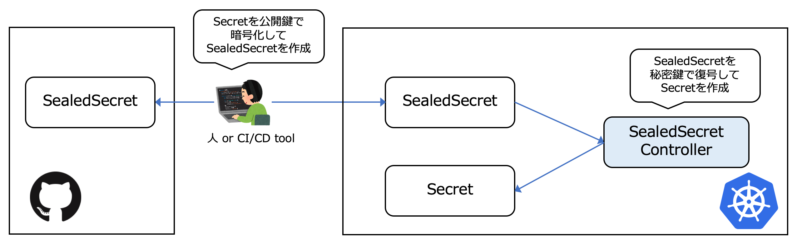

# I. Sealed-secretsでK8S Secret管理


## 1. Install sealed-secrets by helm
- `helm install --namespace kube-system my-release stable/sealed-secrets`

## 2. Install kubeseal
- `brew install kubeseal`

## 3. Create public key mycert.pem from controller
    ```
    kubeseal \
    --controller-name=my-release-sealed-secrets \
    --controller-namespace=kube-system \
    --fetch-cert > mycert.pem
    ```

## 4. LokiログのSecretをデプロイしてみる。
### 4.1 Loki.yamlのSecret部分を無効にする
    ```
    # Source: loki-stack/charts/loki/templates/secret.yaml
    apiVersion: v1
    kind: Secret
    metadata:
    name: loki
    namespace: istio-system
    labels:
        app: loki
        chart: loki-0.30.1
        release: loki
        heritage: Helm
    data:
    loki.yaml: YXV0aF9lbmFibGVkOiBmYWxzZQpja...
    ```
### 4.2 base64にloki-conf-s3.yamlをエンコードする
- `base64 loki-conf-s3.yaml`
- Outputを控えておく

### 4.3 loki-secret.yaml作成
    ```
    [ec2-user@ip-172-31-15-114 secret-management]$ cat loki-secret.yaml 
    apiVersion: v1
    kind: Secret
    metadata:
    name: loki
    namespace: istio-system
    labels:
        app: loki
        chart: loki-0.30.1
        release: loki
        heritage: Helm
    data:
    loki.yaml: YXV0aF9lbmFibGVkOi... # 上のbase64コードを入力
    ```

## 5. encrypt loki-secret.yaml by mycert.pem
- `kubeseal --format=yaml --cert=mycert.pem < loki-secret.yaml > loki-sealedsecret.yaml`
 
## 6. Deploy loki logs
- kustomization.yaml作成
    ```
    apiVersion: kustomize.config.k8s.io/v1beta1
    kind: Kustomization
    resources:
    - loki.yaml
    - loki-sealedsecret.yaml
    ```
- `kubectl apply -k .`

## 7. Deploy 確認
- `kubectl get sealedsecret -n istio-system`
- `kubectl get secret -n istio-system`

# II. KAMUSでK8S Secret管理
- Kamus enable users to easily encrypt secrets than can be decrypted only by the application running on Kubernetes. 
## 1. HELMレポ追加とKAMUS設定
- `helm repo add soluto https://charts.soluto.io`
- `helm upgrade --install kamus soluto/kamus`

## 2. KAMUS-CLI設定
- `npm install -g @soluto-asurion/kamus-cli`
- Kamus application起動
    ```
    export POD_NAME=$(kubectl get pods --namespace default -l "app=kamus,release=kamus,component=encryptor" -o jsonpath="{.items[0].metadata.name}")
    echo "Visit http://127.0.0.1:8080 to use your application"
    kubectl port-forward $POD_NAME 8080:9999
    ```

## 3. KamusSecretにSecretを変換
### 3.1 元のSecret
- `cat 1_Secret.yaml` 
    ```
    apiVersion: v1
    kind: Secret
    metadata:
    name: mysecret
    type: Opaque
    data:
    database.name: ZHluYW1vZGI= # dynamodb
    database.pass: ZHluYW1vZGIucGFzcw== # dynamodb.pass% 
    ```

### 3.2. キーを暗号化するため、KAMUS使用
- database.name暗号化
    ```
    kamus-cli encrypt \
        --secret ZHluYW1vZGI= \
        --service-account pod-env-var \
        --namespace default \
        --kamus-url http://localhost:8080 --allow-insecure-url
    ```
- database.pass暗号化
    ```
    kamus-cli encrypt \
        --secret ZHluYW1vZGIucGFzcw== \
        --service-account pod-env-var \
        --namespace default \
        --kamus-url http://localhost:8080 --allow-insecure-url
    ```

### 3.3KamusSecret.yaml作成
- `cat 2_KamusSecret.yaml`
    ```
    apiVersion: v1
    kind: Secret
    metadata:
    name: mysecret
    type: Opaque
    data:
    database.name: ZHluYW1vZGI= # dynamodb
    (base) duynam@MacBook-Pro 8. Secret management % cat 2_KamusSecret.yaml
    apiVersion: "soluto.com/v1alpha2"
    kind: KamusSecret
    metadata:
    name: mysecret
    type: Opaque
    data:
    user: QfkrYFH0It/d+4TQLYfcHg==:GEV1OgadfFG2zi/sviY14A==
    pass: 5u+it1bHCDf6Tb7m4AjWWg==:RTeNZALbCg1tEA0OSHlmQF5HOeXJYOniIHKkfTP4Zh8=
    ```
- GITなど2_KamusSecret.yamlをアップロードすることができるようになる

### 4. KAMUS復号化確認
    ```
    kubectl apply -f 2_KamusSecret.yaml
    kubectl apply -f 3_Pod_sample.yaml
    kubectl exec -it pod-env-var -- /bin/bash
    env
    ```