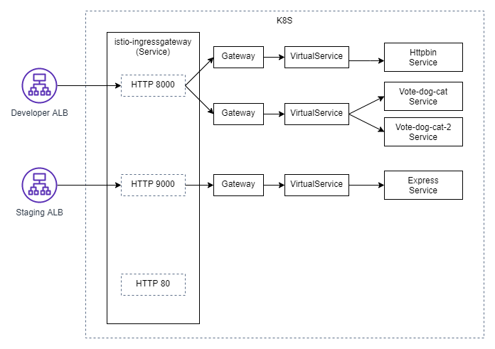
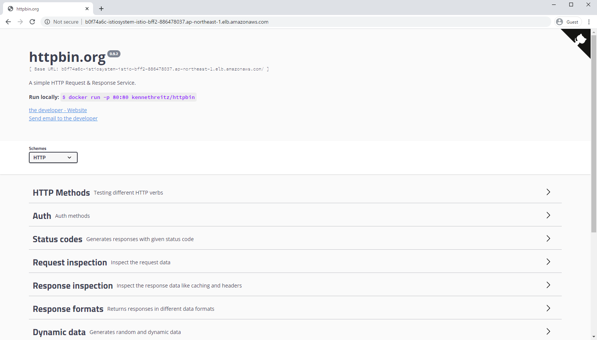
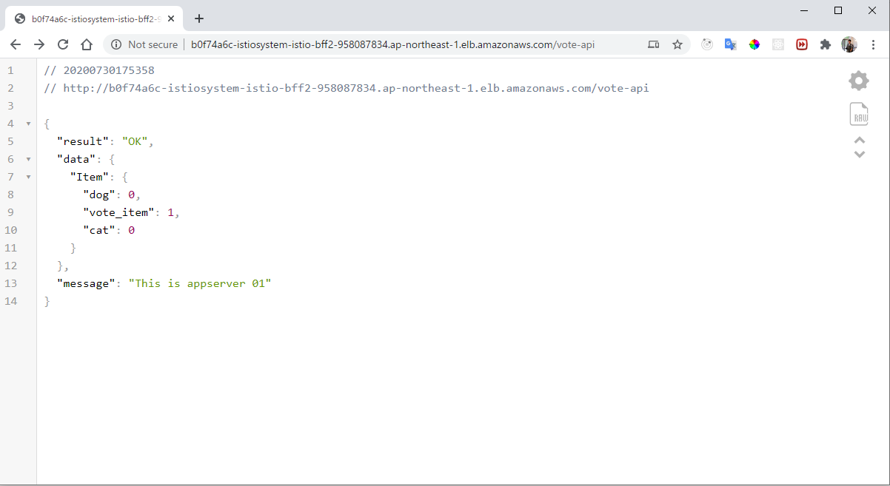
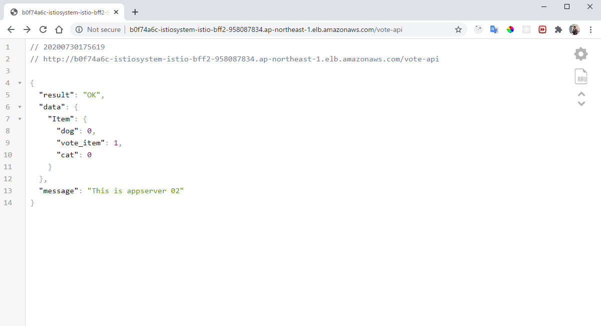
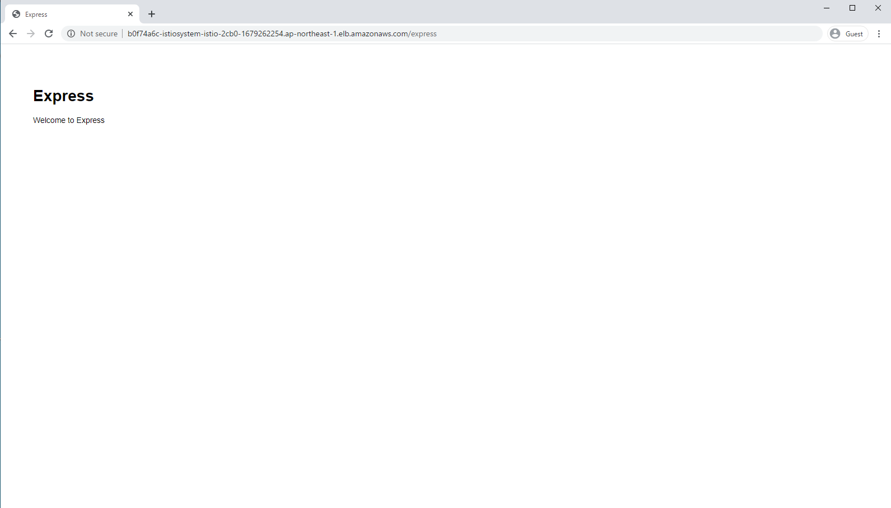

## I. 概要
- システム開発に対して、基本的に3つ環境に分けられる：
    - 開発環境(dev)
    - 検証環境(stg)
    - 本番環境(product)

- 3つ環境でIstioを使用するため、以下の通りイメージができる
    
    

- 環境ごとに１つALBが存在する
- このALBは同じIstio-IngressGateway(Serviceタイプ)につながる
- バックエンド側のサービスもこのIstio-IngressGatewayにつながる
- 各環境がIstio-IngressGatewayのポートに分けられる

### 1. Istio-IngressGatewayの内容 (specのportsに各環境のポートを定義する)
    ```
    apiVersion: v1
    kind: Service
    metadata:
    annotations: null
    labels:
        app: istio-ingressgateway
        istio: ingressgateway
        release: istio
    name: istio-ingressgateway
    namespace: istio-system
    spec:
    ports:
    - name: status-port
        port: 15020
        targetPort: 15020
    - name: http-dev # dev env
        port: 8000 # IngressのBackendPortと似る
        targetPort: 8000　# GatewayのServerPortと似る
    - name: http-stg # stg env
        port: 9000
        targetPort: 9000
    - name: http-product # product env
        port: 80
        targetPort: 80
    - name: https
        port: 443
        targetPort: 8443
    - name: tcp
        port: 31400
        targetPort: 31400
    - name: tls
        port: 15443
        targetPort: 15443
    selector:
        app: istio-ingressgateway
        istio: ingressgateway
    type: NodePort
    ```

### 2. 各環境のALBデプロイ
- 「6_istio/dev-istio-ingress.yaml」と「6_istio/stg-istio-ingress.yaml」をご確認ください。
- backendのserviceNameは「istio-ingressgateway」ですが、servicePortは環境によって設定する
    ```
    ...
    spec:
    rules:
        - http:
            paths:
            - path: /*
            backend:
                serviceName: istio-ingressgateway
                servicePort: 8000 # 環境により
    ...
    ```

### 3. istio-ingressgatewayとバックエンド側のサービスをつなげる
- GatewayオプションとVirutalServiceオプションでつなげる
- istio-ingressgatewayは複数Gatewayにつなげられる
- VirutalServiceは複数サービスにつなげられる

#### 3.1 Gateway設定
    ```
    apiVersion: networking.istio.io/v1alpha3
    kind: Gateway
    metadata:
    name: vote-dog-cat-gateway
    namespace: vote-dog-cat
    spec:
    selector:
        istio: ingressgateway 
    servers:
    - port:
        number: 8000 # istio-ingressgatewayのservicePort
        name: http-dev # istio-ingressgatewayのserviceName
        protocol: HTTP
        hosts:
        - "*"
    ```

#### 3.2 VirtualService設定
    ```
    apiVersion: networking.istio.io/v1alpha3
    kind: VirtualService
    metadata:
    name: vote-dog-cat
    namespace: vote-dog-cat
    spec:
    hosts:
    - "*"
    gateways:
    - vote-dog-cat-gateway # gateway名
    http:
    - match:
        - uri: 
            # uri設定: http://exampleDomain.com/azure-vote
            prefix: /azure-vote
        - uri:
            # css uri設定: frontendアプリのcssパース
            prefix: /static
        route:
        - destination:
            host: frontend
            port:
            number: 8000
        weight: 50
        - destination:
            host: frontend2
            port:
            number: 8000
        weight: 50
    ```

## II. 実機検証
### 1. アップメッシュ一覧



### 2. デプロイ流れ
#### 2.1. Istio download
- `curl -L https://istio.io/downloadIstio | sh -`
- `cd istio-1.6.4/`
- `export PATH=$PWD/bin:$PATH`
- Istioデプロイ:
    - `istioctl manifest apply --set profile=demo`

#### 2.3 Istio-ingressgatewayデプロイ
- `kubectl apply -f istio-ingress-service-replace.yaml`

#### 2.4 開発環境のサービスデプロイ
- Httpbinデプロイ
    - `cd httpbin`
    - `kubectl apply -k .`

- frontendデプロイ
    - `helm install vote-dog-cat vote-dog-cat/`

#### 2.5 検証環境のサービスデプロイ
- Expressデプロイ
    - `cd express-manifest`
    - `kubectl apply -k . `

#### 2.6 ALB Ingressデプロイ
- 事前にALBロールなど設定する必要がある (6. Custom-Istio.mdでご参考ください。)
- `kubectl apply -f istio-ingress-dev.yaml`
- `kubectl apply -f istio-ingress-stg.yaml`

## III. 結果確認
### 1. Ingress取得
- `kubectl get ing -A`
    ```
    [ec2-user@ip-172-31-15-114 6_istio]$ k get ing -A
    NAMESPACE      NAME                HOSTS   ADDRESS                                                                       PORTS   AGE
    istio-system   istio-ingress-dev   *       b0f74a6c-istiosystem-istio-bff2-958087834.ap-northeast-1.elb.amazonaws.com    80      7m15s
    istio-system   istio-ingress-stg   *       b0f74a6c-istiosystem-istio-2cb0-1249686979.ap-northeast-1.elb.amazonaws.com   80      7m2s
    ```

### 2. 画面確認
- 開発環境:
    - `http://b0f74a6c-istiosystem-istio-bff2-958087834.ap-northeast-1.elb.amazonaws.com/`
    

    - `http://b0f74a6c-istiosystem-istio-bff2-958087834.ap-northeast-1.elb.amazonaws.com/vote-api`
        - frontend-1
        

        - frontend-2
        
- 検証環境:
    - `b0f74a6c-istiosystem-istio-2cb0-1249686979.ap-northeast-1.elb.amazonaws.com/express`
    